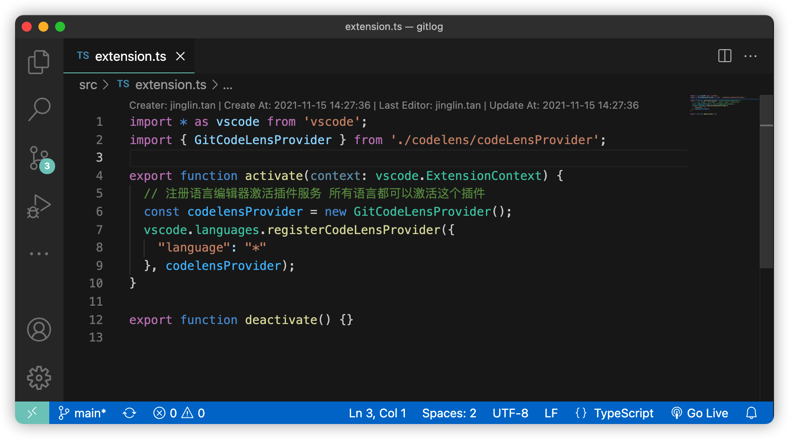

# GitLogHeader
> Fastly and light weight vscode extend for show the file's git info over top

### Use
Search `GitLogHeader` in vscode extends store and install it.

### Effect

### License
[MIT](https://opensource.org/licenses/MIT)

### Linked Me
[Hansuku's Blog](https://www.hansuku.com)

### Contribute project/Issue
[Github/Hansuku/GitLogHeader](https://github.com/Hansuku/GitLogHeader)